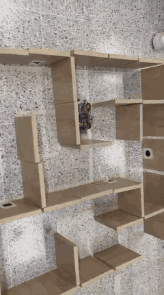
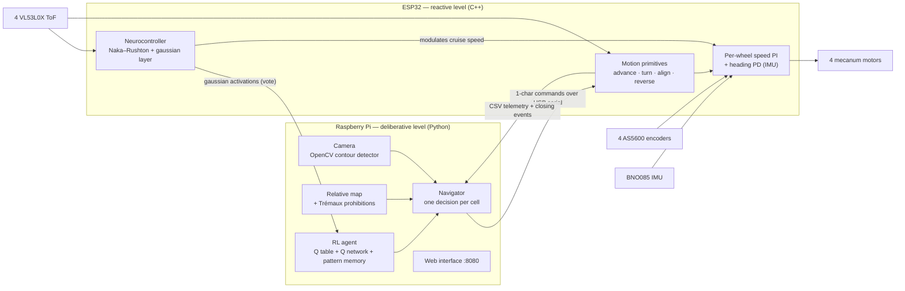

# Midterm 1 — Neurocontrol 2: a mecanum robot that solves unseen mazes with reinforcement learning

A four-wheel **mecanum robot** that enters an unknown maze, finds the exit and
obeys instructions painted on the walls (triangles, circle, square), using a
**hierarchical controller**: an ESP32 runs the real-time control and a
bio-inspired **neurocontroller**, and a Raspberry Pi runs the vision, the map
and a **reinforcement learning** agent.

Universidad Autónoma de Occidente · Cali, Colombia · September 2026.

<p align="center">
  
  <br><em>The robot solving the evaluation maze (12× speed).</em>
</p>

## Highlights

- **A Q(λ) reinforcement learning agent solved a maze built in front of the
  robot, never seen before**, finding the exit at a T-intersection on its
  third visit by learning within the run, with verified obedience to the
  three figures ([report](docs/report.md#viii-b-solving-the-maze)).
- **0.21° of heading error after two full laps** of a closed square circuit
  (8 turns), thanks to an absolute heading grid ([bench test 14](bench_tests/14_square_circuit)).
- **In simulation, the route drops from 53 to 17 steps** (−68 %, the optimal
  route) from the second run on. On the physical robot, memory across runs is
  still limited by odometric drift ([report](docs/report.md#ix-e-memory-across-runs-is-limited-by-odometry)).
- A **ten-state Naka–Rushton / gaussian neurocontroller** on the ESP32 brakes
  the robot near walls with no hand-written rule and votes in every decision.

| The robot | Learning curve (simulation) |
|---|---|
|  |  |

## How it works



- **Reactive level (ESP32).** Guarantees that every motion primitive ends with
  the chassis straight and centered, and that no command crashes it. It owns
  the motors; the Pi only sends primitives and waits for their closing event.
- **Deliberative level (Raspberry Pi).** For each cell: observe → decide (RL, or
  the figure if the camera sees one) → turn → advance → learn.
- **Learning.** Model-free, value-based **Q-learning with eligibility traces
  (Q(λ))**, combined with a neural Q network (MLP 8-32-32-4) and a pattern
  memory, with hard prohibitions on the action set and a softmax policy. Full
  description in [docs/reinforcement_learning.md](docs/reinforcement_learning.md).

## Repository layout

```
.
├── README.md
├── media/maze_run.gif              demo video (12x speed)
├── docs/
│   ├── report.md                   final report (English translation)
│   ├── reinforcement_learning.md   the learning agent in detail
│   ├── assignment.md               the midterm statement and rubric
│   ├── lab_notes/                  calibration and session notes (Sep 14-16)
│   └── figures/
├── firmware/                       ESP32 firmware (PlatformIO, Arduino core 2.x)
│   ├── platformio.ini
│   └── src/main.cpp                27 documented blocks: control, sensors, protocol
├── raspberry_pi/                   deliberative level (Python 3)
│   ├── main.py                     entry point: runs, log, interface
│   ├── navigator.py                state machine: one decision per cell (start here)
│   ├── rl.py                       RL agent: Q(λ) table, Q network, pattern memory
│   ├── maze_map.py                 relative map and short-loop prohibition
│   ├── serial_link.py              USB serial protocol with the ESP32
│   ├── perception.py / camera_master.py / test_camera.py   figure detection
│   ├── web_interface.py + web/     operation interface (with a built-in simulator)
│   ├── data_logger.py              sensor log and automatic diagnosis
│   ├── config.py                   everything tuned in the lab
│   ├── q_network_weights.h         Q network weights pre-trained in simulation
│   └── test_*.py                   headless tests (no robot needed)
├── bench_tests/                    numbered bench tests 11-16 with data and conclusions
├── data/calibration_batches/       raw telemetry of the Sep 14 calibration batches
└── tools/deploy_interface.sh       upload the Pi code and restart the server
```

> **About the code:** comments, docstrings, messages and documentation are in
> English. Identifiers (functions, variables, protocol and data keys) keep
> their original Spanish names, because the firmware, the Pi, the web
> interface and the recorded data share them. Quick glossary:
> `celda` cell · `pared` wall · `giro` turn · `avanzar` advance ·
> `rumbo` heading · `rueda` wheel · `corrida` run · `paso` step ·
> `recompensa` reward · `meta` goal · `salida` exit · `figura` figure ·
> `tabla` table · `red` network · `patron` pattern · `estado` state ·
> `orden` command · directions `N/E/S/O` = North/East/South/**West** ·
> wheels `DI/DD/TI/TD` = front-left/front-right/rear-left/rear-right.

## Running it

### Without the robot

```bash
pip install -r raspberry_pi/requirements.txt
cd raspberry_pi
python3 rl.py                        # learning demo on a random 8x8 maze
python3 test_headless.py             # the whole Pi stack against a fake ESP32
python3 test_logger.py               # sensor logger and diagnosis
python3 test_camera.py --selftest    # figure detector on synthetic figures
python3 test_camera_integration.py   # camera overriding the RL, end to end
```

The web interface also runs on its own, with simulated data:

```bash
python3 -m http.server 8765 --directory raspberry_pi/web
# open http://localhost:8765/?dummy=1 and press START
```


### On the robot

1. **Firmware.** Copy `firmware/src/secrets_example.h` to `secrets.h` and fill
   in the WiFi network (only used for OTA uploads). Flash by cable the first
   time: `cd firmware && pio run -t upload`; afterwards over WiFi:
   `pio run -e wifi -t upload`.
2. **Raspberry Pi.** Copy `raspberry_pi/` to the Pi and start it:
   ```bash
   python3 main.py --port /dev/ttyUSB0 --camera
   ```
3. Open `http://<pi-ip>:8080`, enable the motors and press **START**.

The first time on a new robot, run the direction calibration (`V` bench
command, robot on a stand) and check the notes in
[docs/lab_notes](docs/lab_notes) before driving.

## Results and lessons

- Hard prohibitions on the action set mattered more than any reward tuning;
  the agent exploited every gap in the specification (it went around the maze
  on the outside, and once pushed a wall to shorten the route).
- Most navigation failures came from geometry, not from the policy: the
  chassis sweeps 263 mm when turning in a 250 mm corridor, and odometric map
  drift limits memory across runs.
- Everything is documented with data in [docs/report.md](docs/report.md) and
  in the [bench tests](bench_tests).

## Team

María Alejandra Bocanegra · Eduardo Galeano · Rodrigo Garcés ·
Juan Sebastián Garzón · Santiago Gómez · Juan Pablo Hurtatiz ·
Alejandra Obando Cortés · Nicolás Ochoa · Samuel Pérez · Alejandro Rojas
(alphabetical order).

Repository maintained by Alejandra Obando Cortés.
