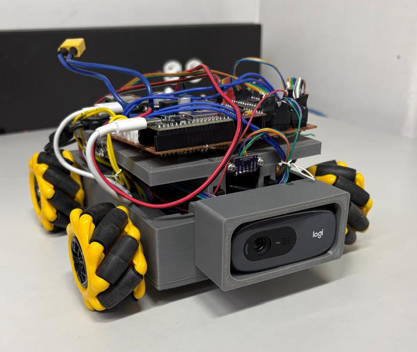
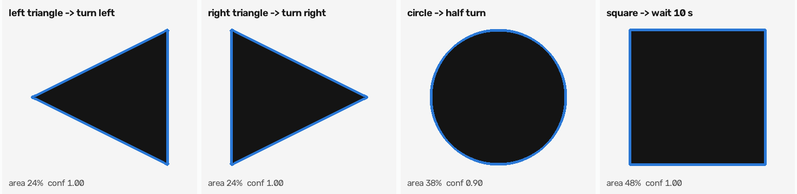
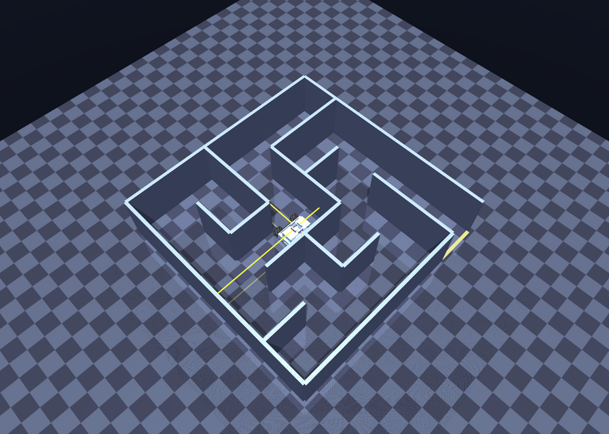
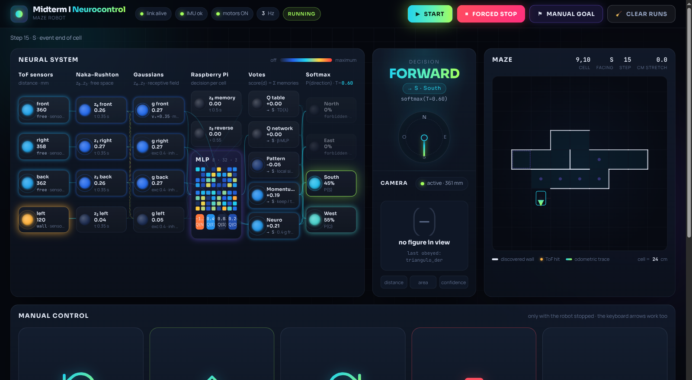
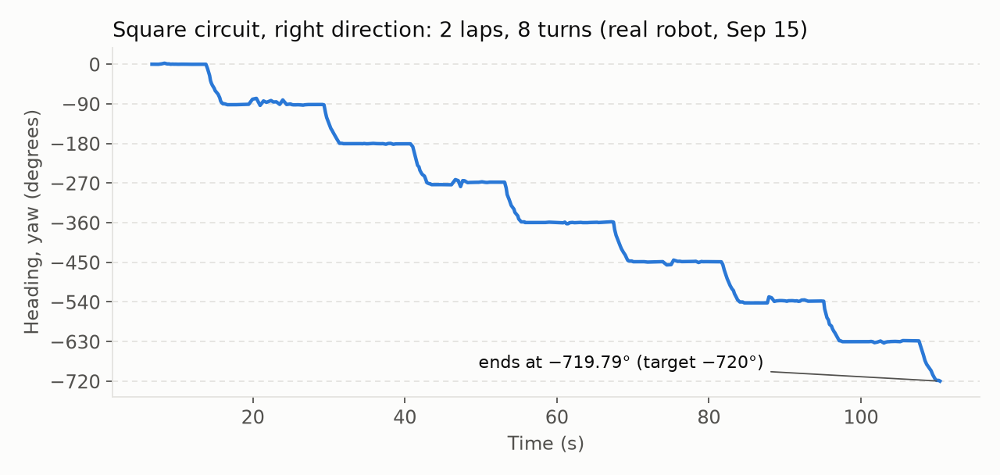
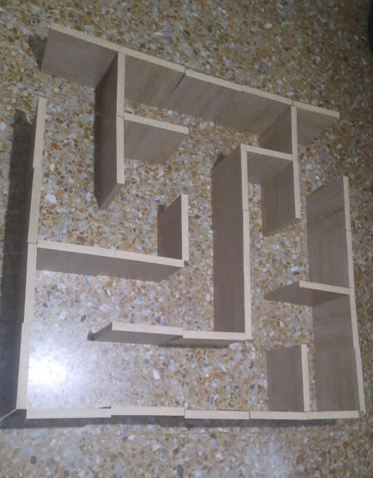
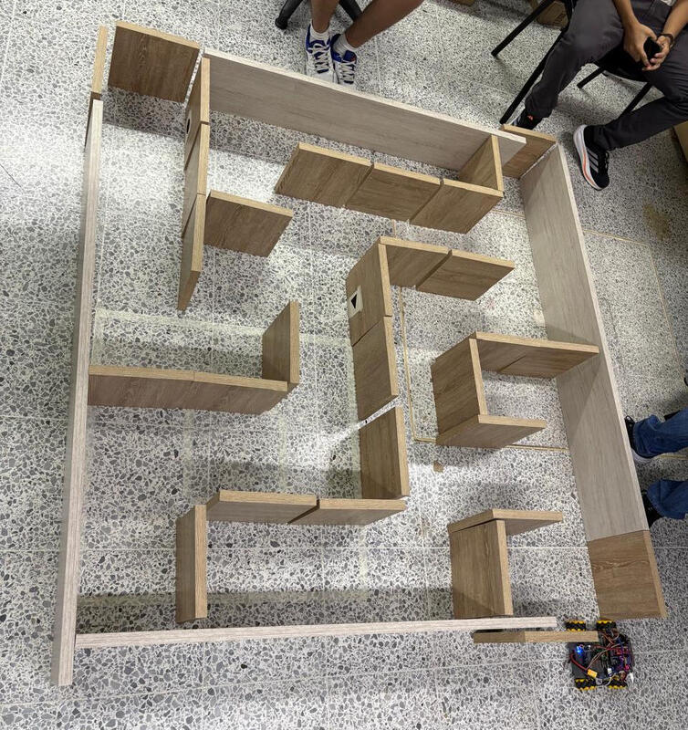
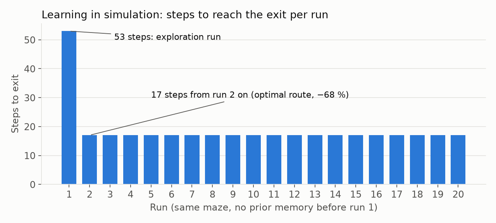

# Omnidirectional robot for maze solving with reinforcement learning

**Neurocontrol 2 · Universidad Autónoma de Occidente · Cali, Colombia**

**Team:** María Alejandra Bocanegra · Eduardo Galeano · Rodrigo Garcés ·
Juan Sebastián Garzón · Santiago Gómez · Juan Pablo Hurtatiz ·
Alejandra Obando Cortés · Nicolás Ochoa · Samuel Pérez · Alejandro Rojas

> English translation of the final report delivered for Midterm 1 (the
> original was written in Spanish, IEEE conference format). The figures were
> regenerated in English from the project data; the originals contained
> Spanish labels.

**Abstract** — We present the design, construction and experimental validation
of a mobile robot with mecanum drive that solves unknown mazes using only its
on-board sensors and a camera that recognizes geometric figures carrying
navigation instructions. The architecture separates two time levels: a
microcontroller runs the reactive control, guaranteeing that every motion
primitive ends with the chassis straight and centered, and an embedded
computer runs the perception, the relative map and a reinforcement learning
agent that decides the direction at each cell. On top of the firmware there is
also a bio-inspired ten-state neurocontroller, whose activations modulate the
cruise speed and enter the decision as one more vote. The document describes
both levels, the experimental bench with which each parameter was calibrated,
the simulation that runs the real navigator and agent on rigid-body physics,
and the findings that shaped the design, in particular the fact that the
sweep of the chassis when rotating exceeds the width of the corridor. The
course maze samples were solved successfully, with verified obedience to the
three figures.

*Index terms* — mobile robotics, mecanum, reinforcement learning,
neurocontroller, Naka–Rushton, computer vision, maze, hierarchical control.

---

## I. The problem and the approach

The course statement poses an autonomous robot that enters a maze of unknown
configuration, travels through it until it finds the exit and, on the way,
obeys instructions encoded as geometric figures attached to the walls: the
triangle indicates the turning direction, the circle orders going back and
the square requires stopping and re-evaluating whether the front wall
disappears. The robot has no prior map, so it must build it on the go and
learn from run to run to shorten the route.

The central design decision was to split the problem into two time levels
with disjoint responsibilities. The reactive level guarantees that every
motion primitive (advance one cell, turn ninety degrees, move up to the wall,
back up) ends with the chassis straight and centered, and that no command
crashes it into a wall. The deliberative level decides, from the observation
of an already stabilized cell, where to go. The alternative — a single
controller that decides and acts — forces the policy to learn at the same
time to navigate and not to crash, and makes any geometric error propagate to
the decision. The project confirmed that concern, in a way the rest of the
document develops: almost no navigation failure came from the policy.

*Fig. 1. The built robot. Chassis printed in three levels on four mecanum
wheels, with the distance sensors on the faces and the camera on a front
mount.*

## II. The system at a glance

The work is split between two computers. The microcontroller owns the motors
and closes the fast loops: speed per wheel, heading and the complete motion
primitives. The embedded computer runs the vision, the relative map of the
maze, the learning agent and the operation interface. Between them there is a
protocol of primitives, not of continuous setpoints: the deliberative level
requests a whole motion, the reactive level executes it to the end and
answers with an event that says how it ended — end of cell, wall, open field,
stall, turn error, misaligned — and no new command is issued until the
previous one has closed.

A design rule runs through the whole firmware: a single owner of the motors.
A single controller writes the speed setpoints at each instant, and every
motion — including the manual control of the interface — goes through the
same per-wheel speed loop. This rule removed a whole family of failures due
to control clashes present in earlier versions, in which two routines wrote
on the same actuators.

The platform is a 200 by 180 mm chassis on four mecanum wheels, which allow
pure lateral translation besides forward motion and rotation on the spot
through the standard inverse kinematics of this configuration [4]. Four
time-of-flight distance sensors face the front, both sides and the back; a
camera faces the front.

## III. Geometry rules over control

The finding that most shaped the design is not about control but about
geometry. Measured on the built robot, the chassis sweeps 263 mm when
rotating on its axis, while the maze corridor is 250 mm wide. The
consequence is that the turn on the spot does not fit inside a corridor: it
can only be executed at intersections, where the space opens to the sides.
In a closed corridor, the only way out is reverse. No gain, no tolerance
adjustment and no policy improvement corrects this, and the firmware
enforces it by rejecting the turns that do not have lateral room.

A physical limit of the same kind appeared in the lateral translation. Below
a certain speed the robot does not translate: it twists. At the lowest
lateral speed tested, the rotation difference between the four wheels
reaches 41 % and the chassis accumulates −8.5° of heading in a second and a
half; at the minimum effective speed the difference drops to 14 % and the
heading error to −0.5°. The cause is that one of the wheels carries a
different gearbox and below a certain regime its reading stops being
repeatable. The design consequence is that every lateral correction is
applied above that minimum speed, and what is modulated is how often the
pulse is applied, not how hard.

## IV. Low-level control

### IV-A. Speed per wheel

Each wheel has a proportional-integral loop in revolutions per minute, with
feed-forward from a learned take-off value saved in non-volatile memory, and
a protection that cuts the motor if the wheel does not respond to the
setpoint. Every motion goes through this loop. Manual control by raw signal
was deliberately removed, because the four motors are not identical: one of
them delivers more than twice the revolutions of the other three for the
same signal, so any open-loop command produces a curved trajectory.

### IV-B. Heading against an absolute grid

A proportional-derivative loop on the heading keeps the direction during the
advance. The reference is not the heading measured when the stretch starts,
but an absolute grid: when the run starts the zero is set and all turn
targets are multiples of ninety degrees with respect to that base. This
choice is what prevents the residual error of one turn from being carried
into the next. In an earlier version, referenced to the starting heading of
each stretch, four turns accumulated between seven and eight degrees and the
robot advanced diagonally. The advance is rejected with a misaligned event
if the deviation from the grid exceeds the tolerance, and the deliberative
level responds by aligning before retrying.

### IV-C. Advancing one cell

The advance reproduces a calibrated profile: an initial ramp from a low speed
up to cruise, progressive braking when a wall is detected ahead, and an
anticipated stop computed from the requested speed and the braking latency.
During the stretch, and only after the ramp, small centering taps are
applied. The stretch can end in three ways: by odometry, when a cell is
completed; by a wall, braking at a fixed distance; or by open field, when the
front and both sides read beyond the useful range, which is the condition
used to recognize the exit of the maze.

A detail that turned out to be necessary: a stretch braked by a wall after
traveling more than half a cell counts as a complete cell, so that the map
does not fall behind the real position of the robot.

### IV-D. Safety and intersections

The firmware keeps wall thresholds per sensor and rejects the advance if the
front sensor sees a wall, reading the sensor directly so as not to carry the
filter delay. Below those thresholds there is a second safety layer that
brakes any motion hard, including manual control. Before each decision the
robot performs a settling routine — alignment and sticking to the wall — and
the deliberative level neither observes nor decides until that routine
closes.

T-intersections get separate treatment. If there is a wall ahead and both
sides are open, the stop happens farther from the wall than in a corner,
because that point corresponds to the center of the crossing cell. The value
was set by analyzing the sensor log: before the rule was introduced, turns
started with the front sensor at a median of 62 mm, i.e. with the robot
stuck at the back of the crossing.

## V. The neural layer

### V-A. Bio-inspired neurocontroller

A ten-state dynamical system inspired by vertebrate sensorimotor circuits
[6] runs in the firmware, integrated with five steps per control cycle. The
first four states are Naka–Rushton neurons [1], one per distance sensor,
whose input is the normalized distance s_i = min(d_i / d_norm, 1):

$$\tau_{NR}\,\dot z_i = -z_i + \frac{s_i^2}{s_i^2 + \sigma^2} \tag{1}$$

The next four form a gaussian layer of directional field, with excitation to
the neighbours and inhibition to the opposite sensor, where
G(θ) = exp(−θ²/2σ_G²) weights each contribution by its angular separation:

$$\tau_{GA}\,\dot z_{4+i} = -z_{4+i} + \mathrm{sat}\big[G(0)\,z_i + w_e\,G(90^\circ)(z_{i-1}+z_{i+1}) - w_i\,G(180^\circ)\,z_{i+2}\big] \tag{2}$$

The two remaining states are a memory neuron and a reverse-permission neuron.

The gaussian activation corresponding to the front modulates the cruise
speed: the robot brakes progressively when approaching a wall without any
explicit rule telling it to. The four gaussian activations are transmitted
to the deliberative level, where they are converted to the absolute frame
and enter the decision as one more vote.

Two corrections to the model are worth mentioning. The first one is about
sampling: integrating five steps per cycle was necessary because with a
single step the effective time constant becomes five times slower and the
slow states stay practically at zero during the whole run, which is easily
confused with an implementation error. The second one is functional: an
inhibition of the front on the rear neuron was added, z_S ← max(0, z_S − z_N),
because in long corridors the rear activation exceeded the front one and the
robot turned back for no reason.

### V-B. Reinforcement learning agent

Each decision is taken with the robot stopped and settled in a cell. The
observation contains the cell of the relative map, the heading, the four
wall flags in the absolute frame, the four distances, the four gaussian
activations, the two remaining states of the neurocontroller, whether the
cell is new and the list of candidate directions.

The value of each direction is estimated through three paths that vote in
parallel. A Q table per cell and direction, updated with temporal
differences and replacing eligibility traces [2], so that a single success
reorders the whole route and not only the last cell. A Q network, a
multilayer perceptron trained online, whose weight in the vote grows with
the number of runs. And a pattern memory, which averages the return per
signature — the combination of walls, heading and sign of the displacement
to the goal — and therefore generalizes between cells with the same
geometry. The score of each absolute direction d is the sum of those votes
plus an inertia term and the corresponding neural activation:

$$S(d) = w_T\,Q_{tab}(c,d) + \beta_k\,Q_{net}(d) + w_P\,V_{pat}(\mathrm{rel}(d)) + M(d,h) + w_N\,z_G(d) \tag{3}$$

and the action is drawn with a softmax restricted to the candidates, with a
temperature that decreases with the number of runs.

### V-C. Hard prohibitions weighed more than rewards

What paid off most in this part was restricting the set of actions, above
any tuning of the reward function. A punishment, however large, never takes
a probability to zero: as long as the direction stays on the menu, sampling
will take it sooner or later. That is why the map imposes Trémaux-style
prohibitions [3] before scoring: a direction whose destination is in the
window of recently occupied cells is not offered; if some candidate leads to
a never-seen cell, only those are offered; the free front is always a
candidate, because the sensors rule over the memory; going back is offered
only if it is the only option; and when leaving a dead end in reverse, the
direction that leads to it is walled off for the rest of the run.
Introducing these rules removed the back-and-forth of the first run,
something no reweighting had achieved.

A related decision: the progress-to-goal term was set to zero. In a random
maze the exit is not at a known coordinate, and with a positive value the
robot was systematically biased towards a corner.

### V-D. Explore and exploit

While no exit is known, the softmax temperature is high and the robot
explores. After the first exit the agent enters exploitation mode: the
temperature drops to its minimum and, if the current cell belongs to the
master route, the direction is taken directly. The master route is the
trajectory of the best run with the loops removed: if a cell repeats,
everything between both visits is deleted. It was found that a minimum
temperature that is too low repeats bad routes when the master route breaks
because of map drift, so an exploration floor was kept.

## VI. Figure perception

The camera runs in its own thread and classifies contours in every frame
with OpenCV [5]: adaptive threshold, polygonal approximation and a decision
by number of vertices, solidity and circularity; the orientation of the
triangle is determined by the position of its apex.

Three independent gates filter each decision. The most restrictive is the
distance one: above 160 mm of front reading the frame is not even analyzed,
because a figure seen from afar belongs to another cell and obeying it
several cells early derails the whole route. A second gate requires the
figure to fill between 4.5 and 80 % of the frame, which discards both a
distant figure and a covered camera. Then there is confidence, based on a
contour solidity above 0.85, which separates a painted figure from a
reflection or a shadow. All three are needed: the area alone can be fooled
by a large figure painted far away, and the distance alone says there is a
wall, not that there is a figure on that wall. The decision is also
confirmed with three consecutive matching frames.

Over the set of accumulated detections, the square is the figure recognized
with the widest margin (confidence between 0.85 and 0.99) and the circle the
one with the narrowest range (0.78 to 0.90, limited by the circularity
threshold). Triangles are the most variable, with confidences from 0.57,
which reflects that their classification depends on correctly locating the
apex and not only on counting sides.

The execution logic turned out less direct than expected, for a physical
reason: the camera stops framing the figure just when the robot reaches it.
The final sequence is to detect it from afar through a burst of matching
frames, stop, evaluate for about a second by majority of frames, store the
order and only then approach head-on until the front sensor marks a wall,
where what was stored is executed even if up close nothing can be seen any
more. The triangle orders turning in the direction it indicates; the circle,
a half turn and re-evaluation of the candidates; the square, stopping while
watching the front wall and advancing if it disappears.

*Fig. 2. The four orders recognized by the contour detector (self-test on
synthetic figures, `raspberry_pi/test_camera.py --selftest`), with the
contour found, the fraction of the frame it fills and the confidence. The
triangle splits into two orders depending on which side its vertex points to.*

## VII. How it was validated

### VII-A. The test bench

Each measurement was done in an independent, self-contained project,
numbered in the order in which it was performed, with its data log and its
written conclusion next to it. The rule kept during the whole project is
that a test that has already passed is not edited: if something has to
change, it is copied into a new test with the next number. This way the
history of what worked on the bench stays intact and it is possible to go
back to any point. In total sixteen tests were run, from verifying the
outputs of the motor drivers to the complete closed circuits
(see [`bench_tests/`](../bench_tests)).

### VII-B. Calibration

The three calibration results that condition everything else are the encoder
signs, the individual curves of each wheel and the linear correction of each
distance sensor. About the signs it is worth being explicit, because it took
a whole session to discover it: three of the four encoder signs were
inverted with respect to what the wiring diagram indicated. An inverted sign
turns the loop into positive feedback, so the control pushes where it should
not and the symptom appears far from the cause. The signs are measured with
the wheels in the air before driving; they are not deduced from the wiring.

Each wheel also has its own start and sustain curve, and its own rpm
ceiling, measured in a dedicated sweep. A negative result worth recording:
the automatic gain indicator of the magnetic encoder is useless to judge the
quality of the measurement. It indicates how far the magnet is from the
chip, not whether it is centered; the wheel with the indicator at the end of
the range turned out to be the one that measures best.

### VII-C. Simulation

A simulation of the maze was built on a rigid-body physics engine that runs
the real navigator and agent, imported without copying, against a simulated
microcontroller that speaks the same protocol of primitives and events as
the firmware.

The value of this piece is not cosmetic. The simulation allows running
dozens of random mazes without spending battery or risking the hardware, and
it detected two regressions that would have been invisible on the floor: one
that walled off good corridors and another that produced a loop of rejected
reverses. It also verified that the map the robot draws matches the real maze.

*Fig. 3. The simulated robot in a randomly generated 5 × 5 cell maze. In
yellow, the rays of the four distance sensors.*

### VII-D. The two interfaces

The two interfaces of the project were built with the same criterion: no
number should appear without saying where it comes from.

The operation interface is served by the embedded computer and opens from
any browser on the network. Its top bar gathers what has to be checked before
moving the robot, with the status of the link, the IMU, the motors and the
telemetry frequency. Below, the neural system unfolds from left to right,
one column per stage, so that one can see what goes in and out of each one.
The other blocks show the current decision with its reason, the map
reconstructed cell by cell separating the confirmed walls from the odometric
trace, the camera view with the status of the three gates, four twenty-second
time series and a telemetry table. From the manual control the robot can be
moved and parameters tuned live without recompiling.

*Fig. 4. Operation interface, here running in its built-in simulator mode
(`raspberry_pi/web/index.html?dummy=1`): the neural system from the raw
sensor readings to the probability distribution over the candidate
directions, the decision and the reconstructed maze.*

The simulation panel serves to understand why the agent decides what it
decides, and it is split into three tabs. *Live* follows the run: it draws
the maze only with what the robot has seen, and not with the truth of the
generator, which is what makes it possible to detect a shifted map at a
glance; next to it go each reward and punishment with their breakdown, the
reading of the sensors against the wall threshold and the last decisions in
text. *Neural system* exposes the Q network inside, the vote breakdown, the
score, the softmax and the firmware neurocontroller, plus three traces that
tell whether the network is still learning or has already settled: the mean
activity of each layer, the agent's certainty against the current
temperature and the norm of the weight change at each gradient step.
*Results* looks at the whole session.

The dead-end failure described in section IX showed up this way. The robot
kept alternating between two cells for 235 steps, with the accumulated
punishment growing down to −49 without the behavior changing. A reward trace
that sinks while the cell does not change is an unmistakable signature, and
it would not have been seen by reading the code or by watching the robot move.

### VII-E. The log as an instrument

During the whole operation the sensor readings, the state of the loops and
the parameters in force are logged, together with a decision log. The
analysis of those logs — the median front distance when starting a turn, the
distribution of the stopping points — is what allowed setting the
thresholds with data instead of by trial and error. This is probably the
working habit with the best effort-to-result ratio of the whole project.

## VIII. Results

### VIII-A. Behavior on the floor

Before integrating the decision layer, the motion primitives were validated
on closed circuits. The robot completed a two-lap square circuit ending with
0.21° of accumulated heading error, and a nine-turn route in which it
chooses at each corner where to turn depending on which side it sees free,
with 0.42° of final error. These two numbers are the evidence that the
absolute grid does its job: the error does not grow with the number of turns.

*Fig. 5. Heading during the two-lap square circuit (right direction),
reconstructed from the log of the run
`bench_tests/14_square_circuit/best_right_2026-09-15_1547`. Dashed lines:
the multiples of 90° of the absolute grid.*

### VIII-B. Solving the maze

Two mazes were used, shown in Fig. 6. The training one has 5 × 5 cells of
25 × 25 cm; the evaluation one, 6 × 6 cells. Both are built with
reconfigurable boards, so the layout changes between sessions and neither
can have been memorized in advance.

| Training maze (5 × 5) | Evaluation maze (6 × 6) |
|---|---|
|  |  |

*Fig. 6. The two mazes used. Left, the training one: 5 × 5 cells of 25 × 25
cm. Right, the evaluation one, of 6 × 6 cells, with the robot placed at the
exit.*

On the training maze, the first solution took about five minutes. That
figure is the full reconnaissance run — without prior memory, exploring —
and it includes the one-second stops in front of each figure and the
settling that precedes each decision. It is the number worth keeping as a
reference for the worst case: the robot has nothing and travels the maze
discarding routes as it exhausts them.

The two samples were solved successfully, with verified obedience to the
three figures. The result that best shows that the agent generalizes, and
does not memorize, is that of the evaluation maze: it was built in front of
the robot at that very moment, with a layout it had never seen, and it solved
it. The reconfigurable board, which complicates the statistics, serves here
as a guarantee that no prior knowledge is possible.

That same route showed the learning at the most unfavorable point. The exit
was at a T-intersection, which is exactly the geometry where the robot loses
the lateral reference and where its errors concentrate. The agent went
through that intersection twice and both times kept going straight without
taking it; on the third it went into the corridor of the T, which was the
one leading to the exit. The correction did not come from a new rule or a
better sensor, but from the fact that the two previous visits had left their
mark on the value of that cell.

Beyond that, the validation was qualitative: it was checked that the robot
reached the exit and executed the right order for each figure, but no
statistics of success rate and time over a controlled number of runs were
collected. The reason is twofold: the maze was rebuilt between sessions, so
the runs are not comparable with each other, and the main source of
variability was not the policy but the state of the battery. Quantifying the
performance requires a repetition protocol with a fixed maze and a
controlled charge, and it is still pending.

### VIII-C. What improves within a run

With the candidate prohibitions active, the reconnaissance run explores
without back-and-forth: the agent discards the routes already tried and
proposes alternatives, which is the desired behavior. In simulation, where
the position is exact, that improvement extends to the following runs: the
reconnaissance run needs 53 steps and from the second one on the agent
settles at 17, a 68 % reduction that corresponds to the optimal route of
that maze. On the physical robot the learning turned out reliable within a
run but not across runs, for the reason explained in section IX.

*Fig. 7. Steps to find the exit, over twenty consecutive runs in the same
maze and without prior memory (simulation). All twenty ended at the exit.*

**Table I — Main system parameters**

| Parameter | Value | Level |
|---|---|---|
| Cruise speed | 0.12 m/s | reactive |
| Front stop (corner / T) | 61 / 110 mm | reactive |
| Wall threshold (front / sides) | 230 / 200 mm | reactive |
| Open field condition | ≥ 500 mm | deliberative |
| Turn tolerance | 4.4° | reactive |
| Chassis (length × width) | 200 × 180 mm | physical |
| Sweep when rotating / corridor width | 263 / 250 mm | physical |
| Minimum effective lateral speed | 120 / 255 (setpoint) | reactive |
| α, λ, γ | 0.30 / 0.85 / 0.90 | deliberative |
| Initial / minimum temperature | 0.60 / 0.20 | deliberative |
| Q network architecture | 8–32–32–4 | deliberative |

## IX. Difficulties

### IX-A. T-intersections

It was the main difficulty. In an asymmetric T-intersection there is no
valid lateral reference: averaging the two side sensors centers the robot
with respect to the arms of the crossing, not with respect to the cell. Five
alternatives were evaluated — an encoder milestone from the mouth of the
corridor, referencing the back wall, sticking to a single wall after the
turn, an arc turn and additional sensors — and the back-wall reference was
adopted, activated only when both sides are open. Errors persist when the
advance brakes for a wall before the T condition is detected; the pending
improvement is the encoder milestone.

### IX-B. The rear sensor

The rear distance sensor turned out unreliable: in open space it returns
readings of a few tens of millimeters most of the time. It was excluded from
the exit condition and from the reverse stop, which was limited to one cell
by odometry. The cause is probably the mounting and it requires a mechanical
review.

### IX-C. A punishment that is too large paralyzes

The first serious problem of the agent was not that it moved badly, but that
it stopped moving. The initial policy punished collisions with enough weight
for the action with the lowest expected risk to be staying still: any
advance could end in a collision, while doing nothing cost almost nothing.
The agent found that minimum and settled in it. The fix was not to reduce the
punishment but to rebalance the weights so that exploring paid off. With the
discovery of a new cell rewarded above the per-step cost, staying still
stopped being the cheap option and the robot moved again. It is the opposite
extreme of the next case, and it is worth seeing them together: a badly
sized punishment produces paralysis, and a badly delimited reward produces
cheating. Both are specification failures, not learning failures.

### IX-D. The policy exploits what the specification leaves open

During training a behavior appeared that is worth documenting because it is
not an implementation failure but one of how the task was posed. If the
robot started outside the maze, the policy learned to go around it on the
outside and show up at the goal without having gone through a single
corridor. From the agent's point of view the solution is optimal: it
collects the full terminal reward with a per-step cost lower than that of any
inner route, and nothing in the reward function penalizes the chosen path.

A later episode, already on the physical robot, confirmed the pattern. On
the training maze, with the learned route, the agent found that one of the
walls separated it from the exit by only two cells, against the full route
the master route imposed on it. It pushed that wall and got out that way,
saving about 60 % of the route. The walls are boards leaning in place, not a
fixed structure, so nothing in the world or in the reward prevented it from
moving them. From the policy's point of view, there was an action that
drastically reduced the per-step cost and nobody had forbidden it.

Both episodes illustrate the same specification problem: the agent optimizes
the declared objective, not the intended one, and any difference between the
two becomes a degenerate strategy. Here the difference was that "solving the
maze" had been encoded only as "reaching the exit cell". Two fixes were
evaluated — penalizing leaving the enclosure or requiring a minimum number of
inner cells — and the simplest and most faithful to the course statement was
adopted: the episode always starts with the robot inside the maze, so the
outside is no longer reachable. The right photo of Fig. 6 corresponds to that
starting condition.

This finding and the one about hard prohibitions point in the same
direction: more is decided over the set of situations the agent can reach
than over the weights of the reward.

### IX-E. Memory across runs is limited by odometry

The agent learns during the reconnaissance run and does so in the expected
sense: it discards the directions it already tried and proposes routes
alternative to the ones traveled. That part works on the physical robot.
What did not turn out reliable was reusing that memory in a later run, and
the cause is not the learning algorithm but the position estimate.

The Q table, the pattern memory and the master route are indexed by cell of
the relative map, and that map is built by odometry. Odometry accumulates
error: mecanum wheels slip by construction, each lateral correction
introduces a fraction of a degree of heading, and the reading of the distance
sensors adds its own noise to the wall flags. It is enough for the estimate to
shift a fraction of a cell for the same physical position to receive an index
different from the one of the previous run. From there on the loaded memory
stops describing the maze the robot has in front of it: it claims there is a
wall where there is none, and the candidate menu — which is built on the map,
not on the instantaneous reading — discards free directions or insists on
blocked ones. The result is that starting a run with prior memory performed
worse than starting it clean.

It is worth being precise about what fails here. The hard-prohibition
mechanism, which is what worked best within a run, is exactly the most
sensitive to this problem, because a prohibition based on a shifted map
cannot be reverted by sensor evidence. It is the same pattern that appears in
the next subsection and in the conclusions: the policy inherits the geometry
without being able to correct it. The way out is not to re-tune the
learning, but to anchor the map to something that does not drift — an
absolute reference or a correction by observing the walls — and that was not
within the scope of this stage.

### IX-F. Good perception is not a good policy

A counter-intuitive result worth documenting. In a parallel line of work,
particle-filter localization and map building were implemented, reaching a
position error of 7.7 cm and a map reconstruction of 96.5 %. When that
information was handed to the policy, the success dropped to 0 %, measured
twice independently. That a signal is correct does not imply that the policy
knows how to use it: widening the observation also widens the space the
agent has to explore, and with the same training budget the result gets worse.

### IX-G. What was tried and did not work

Anticipating the braking by measuring the speed with the distance sensor
does not work, because the refresh of the sensor and that of the control loop
are not synchronized and two consecutive readings often fall within the same
refresh; the speed is taken from the setpoint. Inflating the braking margin
when the link is slow does not work either: a one-second peak makes the robot
stop halfway through a cell. Tightening the turn tolerance below its
calibrated value does not remove the bias, it adds bounces and multiplies the
turn time. Centering the encoder magnets by hand does not help, because the
scale one has to hit is tenths of a millimeter. And sending short pulses
instead of sustained pushes produces jerky motion, because the firmware
safety timer and the loop latency from the deliberative level are of the
same order.

## X. Conclusions

The achievement that best sums up the work is that the robot solved a maze
built in front of it at that very moment, without having seen it before and
without memory of any kind. What was learned is not a route but a way of
traveling, and that was verified at the most unfavorable point: the exit was
at a T-intersection, the geometry where the robot loses the lateral
reference, and even so the agent found it on the third visit.

The separation between a reactive level that guarantees safe and well-ended
primitives and a deliberative level that learns on a relative map turned out
decisive, and the reason is empirical: most of the navigation failures
observed did not come from the policy but from geometric assumptions —
shifted map, unreliable sensors, motions that do not fit — that the policy
inherited without being able to correct them. In a monolithic design those
failures would have been attributed to the learning.

From the decision side, the most transferable result is that hard
restrictions on the set of actions contributed more than any tuning of the
reward function. The three episodes of faulty specification point in the
same direction: the agent paralyzed by a collision punishment that was too
large, the one that went around the maze on the outside and the one that
pushed a wall to shorten the path do not reveal a defect of the learning,
but of what it was asked to learn. With a caveat this project paid for: a
restriction is only as good as the map on which it is evaluated, and with
drifting odometry that same strength becomes the weak point, because a badly
indexed prohibition cannot be reverted by sensor evidence. That is why the
learning is reliable within a run and not across runs. And from the working
method, that the systematic logging of sensors is what allowed setting
thresholds with data instead of by trial and error.

Still open: anchoring the map to a reference that does not drift, which is
the condition for the learned memory to be useful from one run to the next;
the encoder milestone for asymmetric T-intersections; the mechanical review
of the rear sensor; fixing on the robot two navigator failures already
diagnosed in simulation — the back-and-forth when leaving a dead end and the
map board walling off the exit — and a quantitative analysis of the learning
curve over a broad set of mazes.

## References

1. K. I. Naka and W. A. H. Rushton, "S-potentials from luminosity units in
   the retina of fish (Cyprinidae)," *J. Physiol.*, vol. 185, no. 3,
   pp. 587–599, 1966.
2. R. S. Sutton and A. G. Barto, *Reinforcement Learning: An Introduction*,
   2nd ed. Cambridge, MA: MIT Press, 2018.
3. É. Lucas, *Récréations Mathématiques*, vol. 1. Paris: Gauthier-Villars, 1882.
4. O. Diegel, A. Badve, G. Bright, J. Potgieter, and S. Tlale, "Improved
   mecanum wheel design for omni-directional robots," in *Proc. Australasian
   Conf. Robotics and Automation*, 2002.
5. G. Bradski, "The OpenCV library," *Dr. Dobb's Journal of Software Tools*, 2000.
6. I. K. Sarvestani et al., "A computational model of visually guided
   locomotion in lamprey," *Biol. Cybern.*, 2013.
